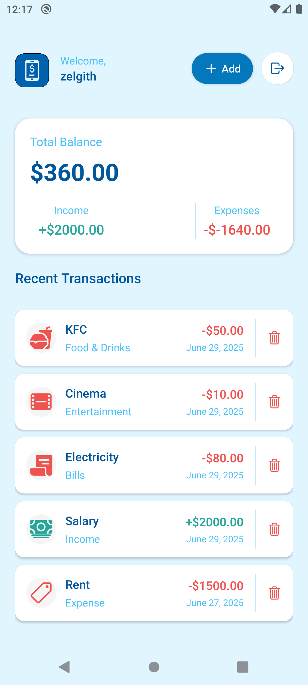
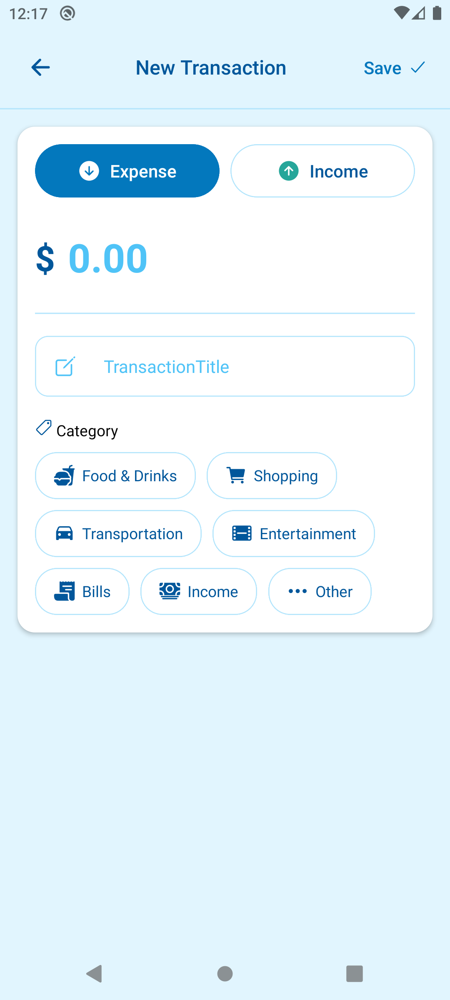

## Get started

1. install dependencies

   ```bash
   npm install
   ```

2. deploy [api](https://github.com/Zelgith/expense-tracker-api)

3. setup .env

```
EXPO_PUBLIC_CLERK_PUBLISHABLE_KEY=your key
EXPO_PUBLIC_API_URL=api url
```

4. start the app

   ```bash
   npx expo start
   ```

In the output, you'll find options to open the app in a

- [development build](https://docs.expo.dev/develop/development-builds/introduction/)
- [Android emulator](https://docs.expo.dev/workflow/android-studio-emulator/)
- [iOS simulator](https://docs.expo.dev/workflow/ios-simulator/)
- [Expo Go](https://expo.dev/go)

<table>
  <tr>
    <td>
      
    </td>
    <td>
      
    </td>
  </tr>
  <tr>
    <td>
      
    </td>
    <td>
      
    </td>
  </tr>
</table>
